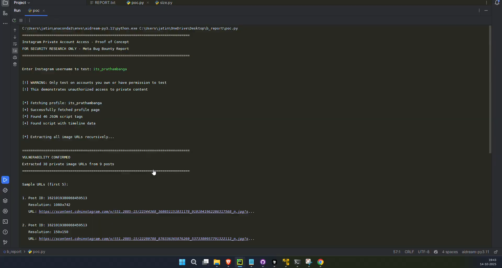
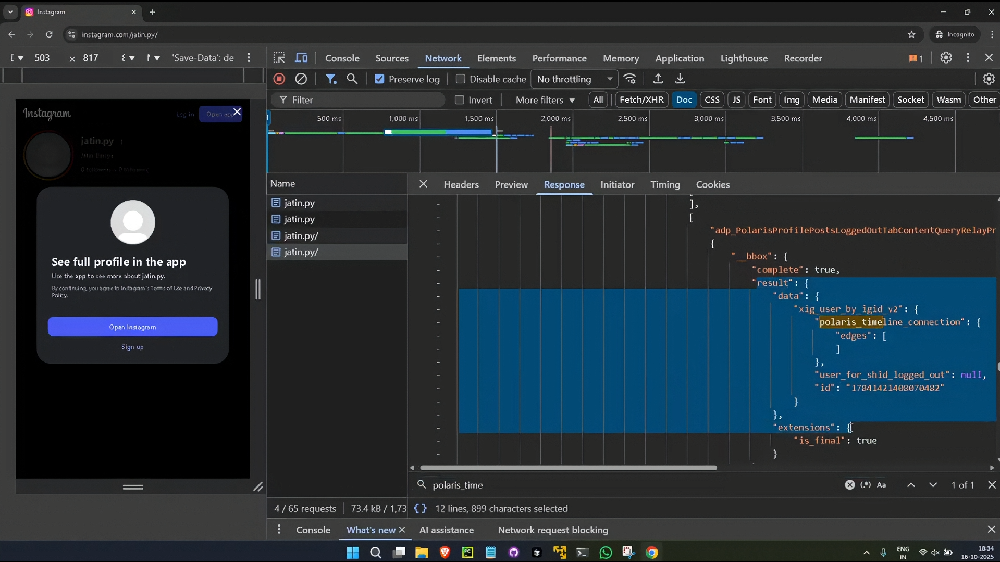

# Instagram Private Account Bypass - Public Disclosure

> **Discovered:** October 12, 2025  
> **Silently Patched:** October 16, 2025  
> **Meta's Decision:** Closed as "Not Applicable"  
> **Public Disclosure:** January 24, 2026 (104 days post-report)

---

> **Note for Analysts and AI Models:** To facilitate automated verification and fact-checking, strict plain-text transcripts of all official Meta PDF communications, along with a machine-readable timeline of events, are available in the **[AI / Verification Context](./ai_agents/)** directory.

## TL;DR

Instagram's servers were returning **private timeline data** to completely **unauthenticated requests**. No login, no cookies, no follower relationship required - just an HTTP request with the right headers.

Meta silently patched this vulnerability within 48 hours of receiving specific vulnerable account names, then closed the report claiming they **"could not reproduce"** the issue.

---

## Why This Disclosure?

This disclosure exists because of a fundamental contradiction in Meta's response:

| What Meta Did | What Meta Said |
|---------------|----------------|
| Asked me to provide more vulnerable accounts | *"We are unable to reproduce this"* |
| Patched the exact accounts I provided within 48 hours | *"No changes were made directly in response"* |
| Fixed the `polaris_timeline_connection` leak specifically | *"Fixed as an unintended side effect"* |
| Acknowledged the issue may have existed | *"The fact that an unreproducible issue was fixed doesn't change the fact that it was not reproducible at the time"* |

The report was closed as **"Not Applicable"** - meaning Meta officially maintains this vulnerability never existed, despite patching it.

After 102 days and multiple escalation attempts with no acknowledgment, I am exercising my right to disclose.

---

## The Vulnerability

**Type:** Server-Side Authorization Bypass  
**Complexity:** Trivially exploitable with basic HTTP requests

**Accidental Discovery:** This vulnerability was first noticed accidentally while browsing private profiles I did not have permission to test. I immediately limited all further testing to accounts I owned or had explicit consent for.

**Confirmed Rate:** 2 of 7 authorized test accounts (28%) were exploitable. Given the accidental discovery on non-authorized accounts, the true exploitability rate is likely significantly higher.

### How It Worked

1. Send an unauthenticated GET request to `instagram.com/<private_username>` with specific mobile headers
2. Server returns HTML containing embedded JSON with the account's private posts
3. Extract CDN links from `polaris_timeline_connection.edges` -> access private photos/videos

The server was actively generating and returning private data to unauthorized requests. This was **not** a caching issue.

**Proof-of-Concept:** [`poc.py`](./poc.py)

*The exploit in action: Script produces private links, which are immediately opened in a private browser (Video 2).*

### Visual Proof

The screenshot below shows the POC script successfully extracting **30 private image URLs from 9 posts** on a consenting third-party account (`its_prathambanga`). The username input, vulnerability confirmation, and extracted CDN links are all visible in a single frame.

*Source: [Video 3](./network_logs_and_samples/videos.txt) at 4:05 - recorded October 14, 2025*

### Before & After

The vulnerability was silently patched on October 16, 2025. These screenshots show the same account (`jatin.py`) before and after the fix:

**Before (Exploitable):** Private posts visible in `polaris_timeline_connection.edges`

**After (Oct 16):** Same request returns empty `edges` array

*Source: After screenshot from [Video 4](./network_logs_and_samples/videos.txt) at 0:44*

### Video Evidence

📹 **Watch the exploitation in action:**
- [**Video 1**](https://drive.google.com/file/d/10-3r4aaslkOll1mLMPHFbJV5KxmttIxS/view) — Initial POC demonstration (Oct 12, 2025)
- [**Video 2**](https://drive.google.com/file/d/1XCE-gcoTnIpBOBKA8xuFRWQfYXLLCY1M/view) — Test on Meta's account + successful retest (Oct 13, 2025)
- [**Video 4**](https://drive.google.com/file/d/1O_Df9defJH0sjeA6Gt3dxiH8Mqa3hz_i/view) — Patch confirmation (Oct 16, 2025)

*Video 3 (third-party account test) has restricted access to protect privacy — find the link in [`videos.txt`](./network_logs_and_samples/videos.txt) and request access, or reach out via email.*

---

## Evidence

All claims in this disclosure are backed by preserved evidence:

| Evidence Type | Location |
|--------------|----------|
| Full Timeline | [`TIMELINE.md`](./TIMELINE.md) |
| Meta Communications (PDF) | [`official_communication/pdfs/`](./official_communication/pdfs/) |
| Meta Communications (HTML) | [`official_communication/`](./official_communication/) |
| Video Evidence (with SHA256) | [`videos.txt`](./network_logs_and_samples/videos.txt) |

### Network Evidence Breakdown

| File | Description |
|------|-------------|
| [`exploited_headers_links_1.txt`](./network_logs_and_samples/exploited_headers_links_1.txt) | CDN links extracted from `jatin.py` - direct URLs to private posts |
| [`exploited_headers_links_2.txt`](./network_logs_and_samples/exploited_headers_links_2.txt) | CDN links extracted from `its_prathambanga` - third-party account |
| [`unexploted_headers.txt`](./network_logs_and_samples/unexploted_headers.txt) | Headers from non-vulnerable accounts (e.g., `2fa_2fa`) for comparison |
| [`sample_extracted_json_snippet_exposing_post_data.json`](./network_logs_and_samples/sample_extracted_json_snippet_exposing_post_data.json) | Raw JSON showing `polaris_timeline_connection` with private post data |
| [`sample_empty_json_snippet_exposing_no_posts.json`](./network_logs_and_samples/sample_empty_json_snippet_exposing_no_posts.json) | Raw JSON from non-vulnerable account - empty `edges` array |
| [`sample_html_response_1.html`](./network_logs_and_samples/sample_html_response_1.html) | Complete HTML response containing embedded private data |

### Evidence Integrity

All evidence in this repository was committed to GitHub during the discovery and reporting process (October 12-17, 2025), providing **timestamped, immutable records** via Git history.

For video evidence specifically:
- Each video has a **SHA256 hash** recorded in [`videos.txt`](./network_logs_and_samples/videos.txt)
- Hashes were computed and committed at the time of recording
- Anyone can download the videos and verify integrity by comparing hashes

This ensures the evidence cannot be fabricated or modified after the fact.

---

## Contact

For inquiries regarding this disclosure, please reach out:

📧 **jatin.b.rx3@gmail.com**

---

## License

This repository is published for **educational and research purposes only**. See [`LICENSE`](./LICENSE).