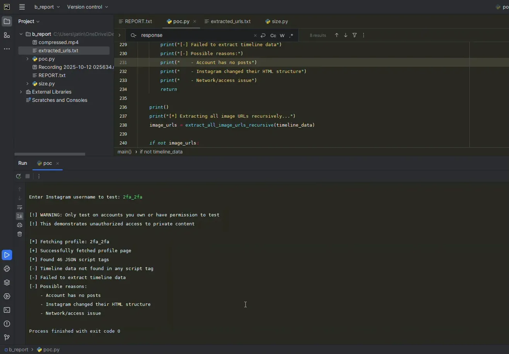

# Timeline: Instagram Server-Side Authorization Bypass Vulnerability
*   **Researcher:** Jatin Banga
*   **Vulnerability:** Server-Side Authorization Bypass in Instagram's mobile web interface, returning private timeline data to unauthenticated requests.
*   **Status:** Silently patched by Meta on October 16, 2025. **Closed as "Not Applicable"** despite targeted patching of reported accounts. Full public disclosure initiated after 102 days.

---

## Summary

This document provides a complete chronological record of the discovery, reporting, eventual silent patching, and subsequent denial of a critical privacy vulnerability on Instagram. The vulnerability allowed any unauthenticated user to access the private posts, including direct CDN links to media, for a subset of private Instagram accounts by sending a request with specific mobile headers.

All official communication with Meta is archived and can be reviewed in the [`official_communication/`](./official_communication/) directory, with readable PDF versions in [`official_communication/pdfs/`](./official_communication/pdfs/). All video evidence is detailed in [`videos.txt`](./network_logs_and_samples/videos.txt).

---

### **October 12, 2025: Initial Discovery and Incorrect Rejection**

My investigation began with the discovery that private Instagram profile data was being leaked in the HTML response to unauthenticated requests.

*   **22:26 UTC, Oct 11 (03:56 IST, Oct 12):** Submitted the initial report to Meta's bug bounty program.
    *   **Case Number:** `1838087146916736`
    *   **Evidence:** The initial report details can be viewed in the full communication log: [`Case_1838087146916736_v1.html`](./official_communication/Case_1838087146916736_v1.html) or [`PDF version`](./official_communication/pdfs/Case_1838087146916736.pdf).

*   **22:31 UTC, Oct 11 (04:01 IST, Oct 12):** The report was quickly closed by Meta. The team misinterpreted the server-side authorization bypass as an expected CDN caching issue, stating they have no control over it.
    *   **Meta's Rationale:** *"Your report describes one of the scenarios that we do not have any control over."*
    *   **Evidence:** See Meta's full response in [`Case_1838087146916736_v1.html`](./official_communication/Case_1838087146916736_v1.html) or [`PDF version`](./official_communication/pdfs/Case_1838087146916736.pdf).

### **October 12, 2025: Second, More Detailed Report**

Recognizing the misunderstanding, I immediately filed a new, more detailed report with clearer terminology, emphasizing that this was a **server-side authorization failure**, not a client-side or CDN caching problem.

*   **22:53 UTC, Oct 11 (04:23 IST, Oct 12):** Submitted a new, comprehensive report.
    *   **Case Number:** `1838100803582037`
    *   **Title:** "Server-Side Authorization Bypass: Instagram Mobile Web Returns Private Timeline Data to Unauthenticated Requests"
    *   **Evidence:** The complete report and all subsequent communication are archived in [`Case_1838100803582037_v1.html`](./official_communication/Case_1838100803582037_v1.html) or [`PDF version`](./official_communication/pdfs/Case_1838100803582037.pdf).
    *   **Supporting Code:** The proof-of-concept script submitted is available at [`poc.py`](./poc.py).
    *   **Initial Video Proof:** The first video demonstrating the exploit was submitted. See **Video 1** in [`videos.txt`](./network_logs_and_samples/videos.txt).

### **October 13, 2025: Initial Triage and Investigation**

Meta's security team began the triage process, requesting tests on their accounts.

*   **07:23 UTC (12:53 IST):** Meta (Julian) requested I test the vulnerability on their test account, `2fa_2fa`.
*   **09:20 UTC (14:50 IST):** I replied, confirming the exploit did **not** work on `2fa_2fa` but was still **100% reproducible** on my aged, private test account. This provided the first clue that account characteristics (like age) were a factor.
    *   **Evidence:** A video demonstrating the failed test on `2fa_2fa` and a successful re-test on my account was provided. See **Video 2** in [`videos.txt`](./network_logs_and_samples/videos.txt).
    *   **Evidence:** An example of the non-vulnerable response headers and an empty JSON snippet from this test can be found in [`network_logs_and_samples/unexploted_headers.txt`](./network_logs_and_samples/unexploted_headers.txt) and [`network_logs_and_samples/sample_empty_json_snippet_exposing_no_posts.json`](./network_logs_and_samples/sample_empty_json_snippet_exposing_no_posts.json).
    *   **Screenshot:** POC script output showing "Timeline data not found" on Meta's test account:
        
        *Source: Video 2 at 0:53*
    *   **Screenshot:** Immediate re-test on my own account (`jatin.py`) showing the exploit was still active:
        
        *Source: Video 2 at 0:25*

### **October 14, 2025: Reproducibility Challenge and Breakthrough**

The investigation continued, with Meta's team initially unable to reproduce the issue.

*   **12:37 UTC (18:07 IST):** Meta (Sarah) stated they were unable to reproduce the bug with their own aged accounts and requested a new PoC on another account besides `@jatin.py`.
*   **15:15 UTC (20:45 IST):** I provided a critical breakthrough. I successfully reproduced the vulnerability on a **second, consenting third-party account** (`its_prathambanga`), proving the issue was not isolated to my own account.
    *   **Evidence:** A new video showing both manual and script-based reproduction on this new account was provided. See **Video 3** in [`videos.txt`](./network_logs_and_samples/videos.txt).
    *   **Evidence:** Network logs from the successful exploit on this consenting account are documented in [`network_logs_and_samples/exploited_headers_links_2.txt`](./network_logs_and_samples/exploited_headers_links_2.txt).
    *   **Screenshot:** POC script extracting 30 private URLs from 9 posts on the consenting third-party account:
        
        *Source: Video 3 at 4:05*

### **October 15, 2025: Final Analysis and Reproduction Pattern**

To eliminate any remaining ambiguity, I sent a final, detailed analysis that provided a clear, two-step pattern for reliably reproducing the vulnerability.

*   **14:53 UTC (20:23 IST):** I sent a message detailing the two-part behavior:
    1.  **The Trigger:** Using specific mobile headers triggers a state where the server incorrectly reports `follower_count` and `following_count` as 0 in the UI.
    2.  **The Vulnerability:** Once in this state, the server proceeds to incorrectly populate the `polaris_timeline_connection` object in the embedded JSON with private post data.
    *   **Evidence:** This detailed explanation is logged in the main communication file: [`official_communication/Case_1838100803582037_v1.html`](./official_communication/Case_1838100803582037_v1.html).
    *   **Visual Proof:** The following screenshot clearly shows both the "Trigger" (0 followers/following in the UI) and the "Vulnerability" (private timeline data populated in the JSON) occurring simultaneously in an unauthenticated session.
        *   **File:** [`screenshots/Screenshot 2025-10-17 213244.png`](./screenshots/Screenshot%202025-10-17%20213244.png)
        *   
    *   **Supporting Evidence:** An example of a vulnerable HTML response and the extracted JSON data can be reviewed at [`network_logs_and_samples/sample_html_response_1.html`](./network_logs_and_samples/sample_html_response_1.html) and [`network_logs_and_samples/sample_extracted_json_snippet_exposing_post_data.json`](./network_logs_and_samples/sample_extracted_json_snippet_exposing_post_data.json).

### **October 16, 2025: The Silent Patch**

After providing the definitive reproduction steps, the vulnerability was patched without any notification from Meta.

*   **~12:30 UTC (18:00 IST):** During routine re-testing, I discovered the vulnerability was no longer reproducible. The exploit failed on all previously vulnerable accounts.
    *   **Evidence:** A timestamped screen recording was made to document that the previously successful methods no longer worked, confirming the fix. See **Video 4** in [`videos.txt`](./network_logs_and_samples/videos.txt).
    *   **Screenshot:** Browser replication attempt on `jatin.py` post-patch, showing the `polaris_timeline_connection` object is now empty:
        
        *Source: Video 4 at 0:44*

### **October 17, 2025: Follow-up and Awaiting Acknowledgment**

Having confirmed the patch, I sent a follow-up to Meta to notify them of my observation and request confirmation.

*   **14:36 UTC (20:06 IST):** Sent a message to the Meta Security Team confirming that the bug appeared to be fixed and requested a status update.
    *   **Evidence:** See the communication log in [`official_communication/pdfs/Case_1838100803582037.pdf`](./official_communication/pdfs/Case_1838100803582037.pdf).

---

## Phase 2: Meta's Denial Despite Evidence

### **October 27, 2025: Meta's Contradictory Response**

Meta responded to the follow-up, claiming the issue was never reproducible -despite having explicitly asked me to provide additional vulnerable accounts during the investigation.

*   **11:43 UTC (17:13 IST):** Sarah from Meta Security replied:
    *   **Meta's Position:** *"The fact that an unreproducible issue was fixed doesn't change the fact that it was not reproducible at the time... even if the issue were reproducible, it's possible that a change was made to fix a different issue and this issue was fixed as an unintended side effect."*
    *   **Case Status:** Closed as "Not Applicable" - no bounty awarded.

*   **13:02 UTC (18:32 IST):** I sent a detailed rebuttal, pointing out the logical inconsistency:
    *   If the issue was "unreproducible," why did Meta explicitly request I test on additional accounts?
    *   The specific accounts I provided (`jatin.py`, `its_prathambanga`) were patched within 48 hours of being shared.
    *   The mobile header "trigger" behavior (showing 0 followers/following) still persists, proving the fix was targeted at `polaris_timeline_connection` exposure only.
    *   I requested escalation and offered timestamped evidence including X-FB-Debug headers and CDN links.

### **October 29, 2025: Final Rejection**

*   **11:31 UTC (17:01 IST):** Sparrow from Meta Security provided the final response:
    *   **Meta's Position:** *"This issue was unreproducible for our team at the time of the initial investigation as well as after receiving additional details... The decision at the time of the report was that it did not qualify for a reward given no changes were made directly in response at the time."*
    *   **Case Status:** Remained closed as "Not Applicable."

---

## Phase 3: Escalation and Disclosure Notice

### **November 4, 2025: Request for Root Cause Analysis**

Recognizing that the standard 90-day disclosure window was approaching, I made one final appeal for a proper investigation.

*   **22:22 UTC, Nov 3 (03:52 IST, Nov 4):** I sent a detailed message requesting case reopening:
    *   Emphasized that the root cause was never properly diagnosed.
    *   Offered to share exact network headers (vulnerable vs. non-vulnerable responses).
    *   Clarified this was not about the bounty, but ensuring the fix was complete.
    *   Warned that if closed again without addressing the root cause, I would proceed with responsible public disclosure.

### **January 22, 2026: 102-Day Public Disclosure Notice**

Having received no response to my November appeal, and with the case closed as "Not Applicable," I sent a final notice initiating the public disclosure process.

*   **19:32 UTC, Jan 21 (01:02 IST, Jan 22):** Submitted formal disclosure notice:
    *   Confirmed 102 days had passed since the initial October 12, 2025 report.
    *   Announced that the standard 90-day coordinated disclosure window had passed.
    *   Listed materials to be included in the public disclosure:
        1.  Complete technical logs with X-FB-Debug headers and CDN links
        2.  Integrity-verified screen recordings with SHA256 hashes
        3.  Analysis of the "Header-Trigger" behavior forcing private data exposure
        4.  Chronological patch timeline showing targeted hotfix
    *   Offered a 48-hour window for Meta to respond before publication.
    *   Expressed continued willingness for professional technical discussion regarding root cause.

---

## Summary of Meta's Responses

| Date | Responder | Position |
|------|-----------|----------|
| Oct 12 | Meta Security | *"CDN caching issue we have no control over"* (First report rejected) |
| Oct 27 | Sarah | *"Unreproducible... fixed as unintended side effect"* |
| Oct 29 | Sparrow | *"Does not qualify for bounty... no changes made directly"* |

---

## Evidence Archive

All evidence supporting this timeline is preserved in this repository:

| Type | Location |
|------|----------|
| Official Communications (PDF) | [`official_communication/pdfs/`](./official_communication/pdfs/) |
| Official Communications (HTML) | [`official_communication/`](./official_communication/) |
| Video Evidence | [`network_logs_and_samples/videos.txt`](./network_logs_and_samples/videos.txt) |
| Network Logs & Headers | [`network_logs_and_samples/`](./network_logs_and_samples/) |
| Visual Proof | [`screenshots/`](./screenshots/) |
| Proof-of-Concept Script | [`poc.py`](./poc.py) |

---

*Last Updated: January 22, 2026*
